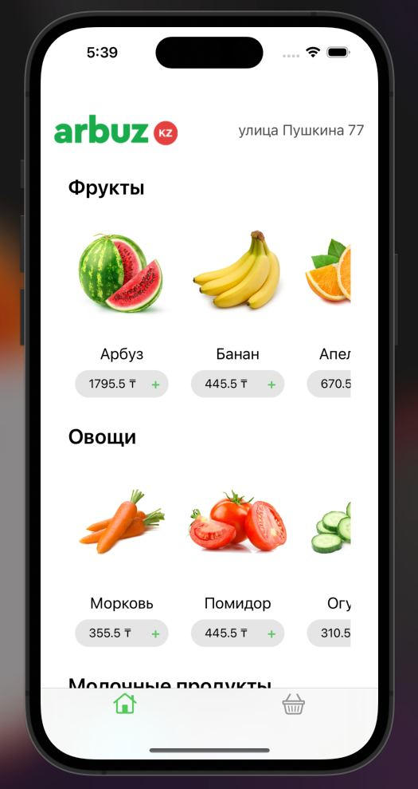
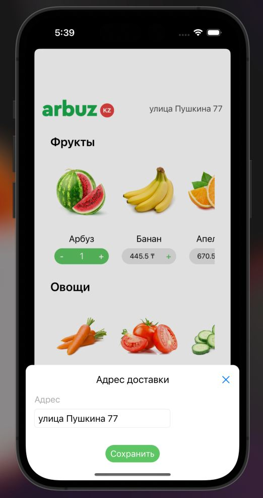
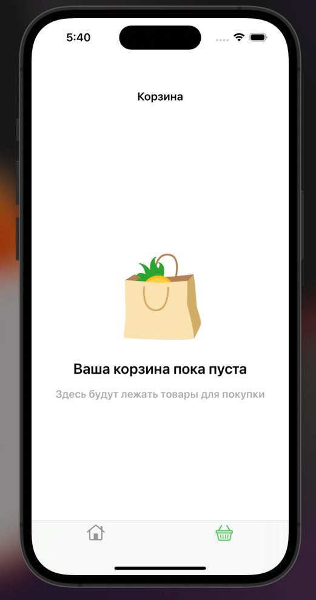
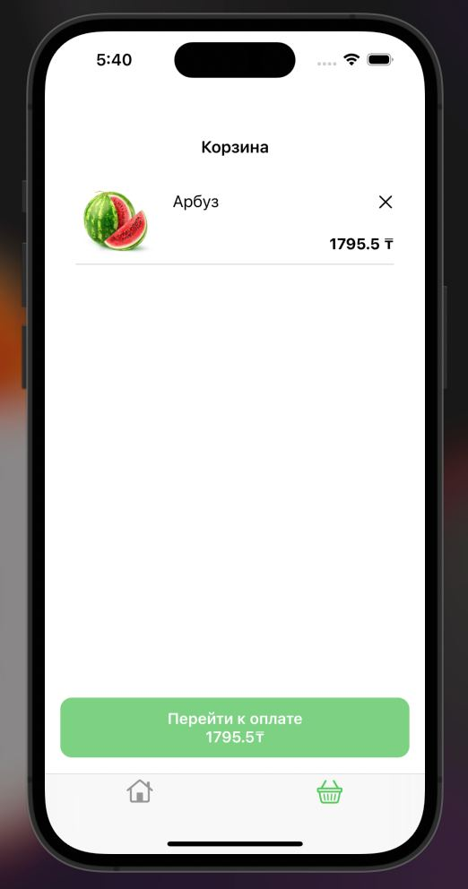
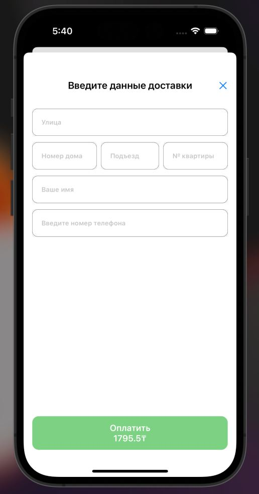

# ArbuzApp

Table of Contents

<ol>
    <li>
      <a href="#about-the-project">About The Project</a>
      <ul>
        <li><a href="#built-with">Built With</a></li>
      </ul>
    </li>
    <li><a href="#contact">Contact</a></li>
</ol>

## About The Project

<h5>ArbuzApp</h3>
    

        
        
        
    

    

        
        
        
    

### Built With

In this project:

- [UIKit](https://developer.apple.com/documentation/uikit)

## Contact

[Alikhan](https://www.instagram.com/gubayevv/) - jonasofan.gubaev@gmail.com

Project Link: [ArbuzApp](https://github.com/akidra4L/ArbuzApp)

